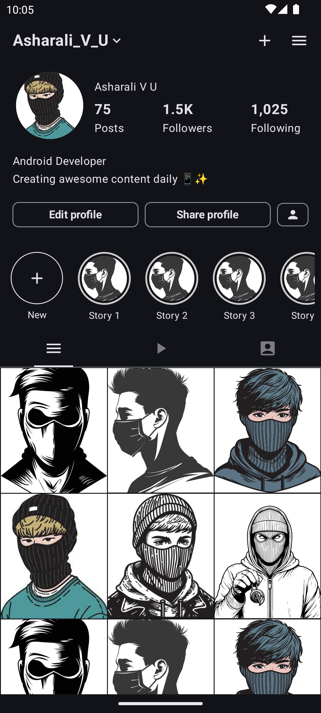
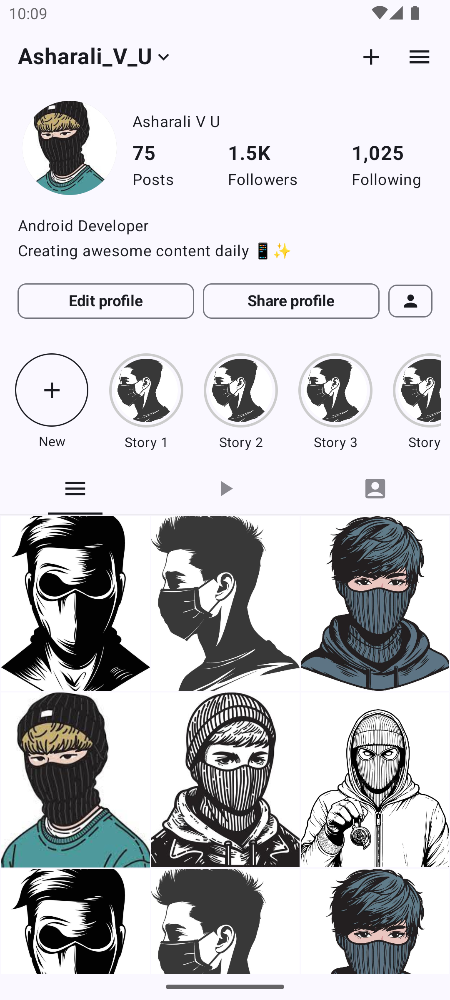

# Instagram Profile App

A sample Android application that demonstrates an Instagram profile UI implementation using Jetpack
Compose.

## Demo

### Video Recording

https://github.com/asharalikannadipoil/InstaProfile/blob/master/recording/video_record.webm

### Screenshots

  
  &nbsp;&nbsp;&nbsp;&nbsp;&nbsp;&nbsp;
  
  &nbsp;&nbsp;&nbsp;&nbsp;&nbsp;&nbsp;
  
  &nbsp;&nbsp;&nbsp;&nbsp;&nbsp;&nbsp;
  

### APK

https://github.com/asharalikannadipoil/InstaProfile/blob/master/APK/app-debug.apk

