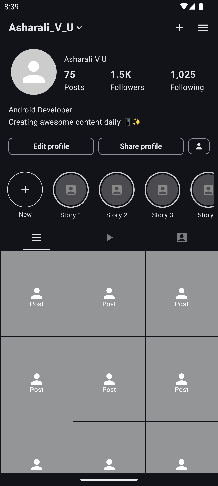
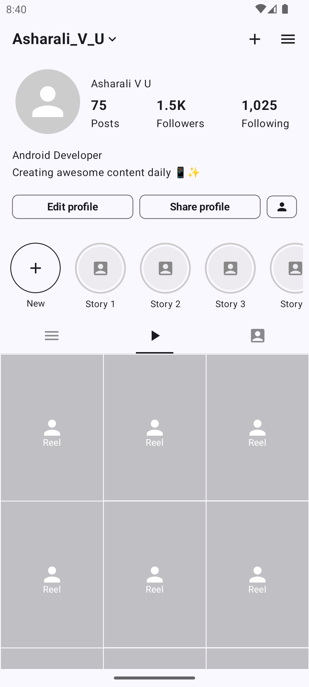

# Instagram Profile App

A sample Android application that demonstrates an Instagram profile UI implementation using Jetpack Compose.

## Demo

### Video Recording

https://github.com/asharalikannadipoil/InstaProfile/blob/main/recording/video_record.webm

### Screenshots

  
  

